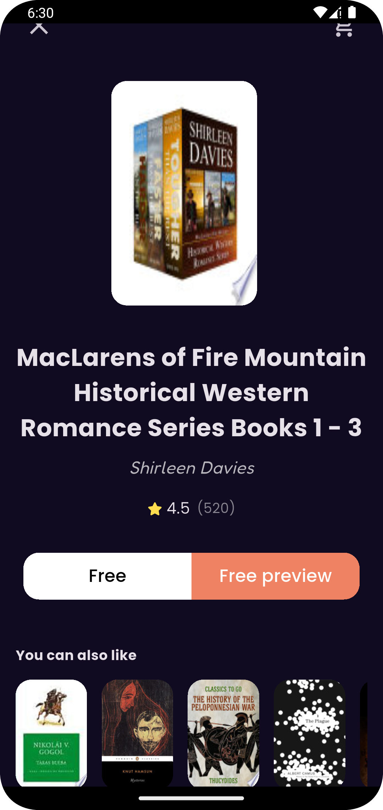
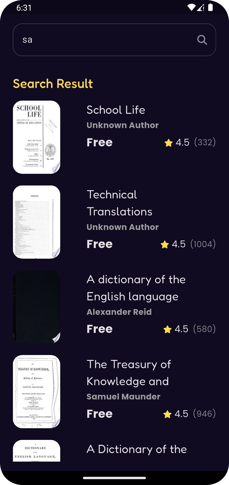

# run_way
A beautiful and responsive Flutter app that allows users to browse, view, and explore a collection of books fetched from the Google Books API.
The app includes modern UI, smooth navigation, detailed book views, and categorized book listings.
## 📸 Screenshots

✨ Features
▪️ Fetch books from the Google Books API based on different subjects.
▪️ Display lists of Featured Books, Best Sellers, and Similar Books.
▪️ Show book details, including title, author, rating, and preview link.
▪️ Search functionality to find books by keywords.
▪️ Responsive UI with smooth page transitions and interactive elements.
▪️ Navigate between multiple views using GoRouter.
▪️ Book rating widget, custom bottom navigation bar, and custom components.
▪️ Error handling and loading indicators using Cubit and BlocBuilder.

🛠️ Technologies Used
▪️ Flutter & Dart – Core development framework.
▪️ Dio – For making HTTP requests to the Google Books API.
▪️ Cubit (Bloc) – State management for handling UI states.
▪️ GoRouter – For efficient and declarative navigation.
▪️ Custom Widgets – Reusable UI components for better modularity.
▪️ Google Books API – External RESTful API used for fetching book data.
▪️ MediaQuery & Responsive Layouts – For adaptive design across devices.